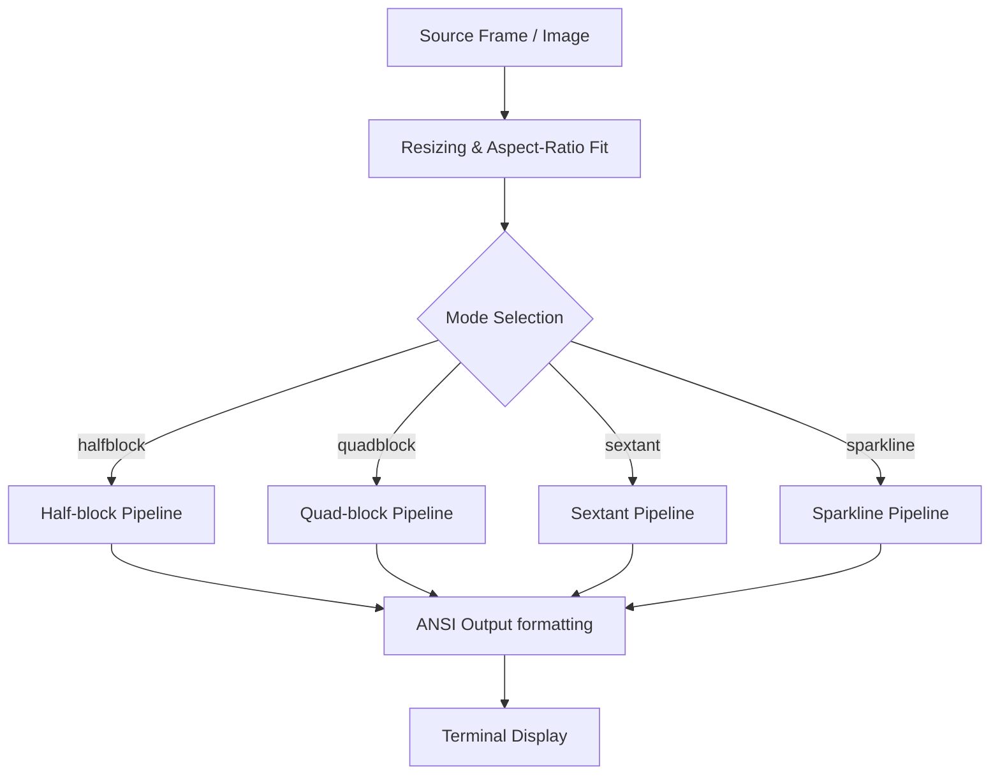
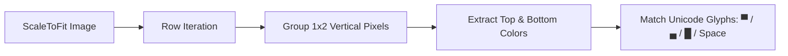
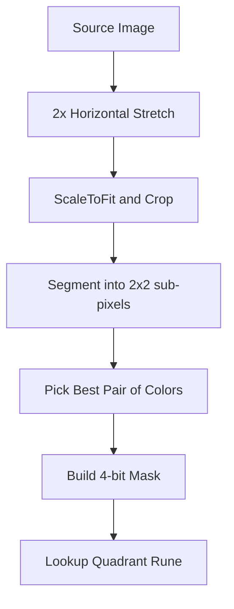
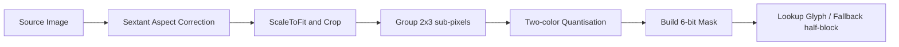
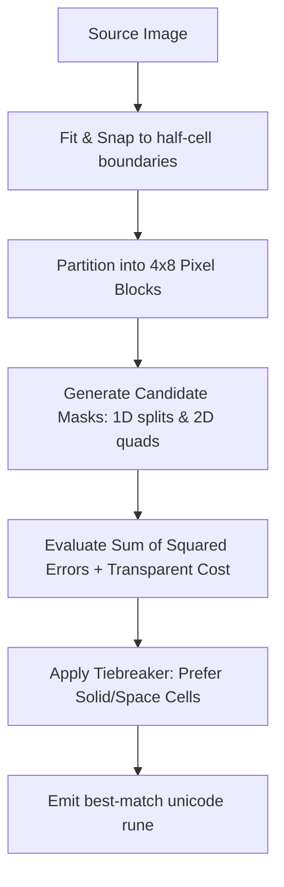

# Render Pipelines


This document details the terminal rendering pipelines in **Cati**. It covers the layout geometry, pixel-to-cell mapping, aspect-ratio corrections, and character selection logic for each rendering mode.

---

## 1. General Pipeline Architecture

Cati takes a source image or video frame and runs it through a pipeline that scales the image (preserving aspect ratio), performs color quantisation, matches sub-pixel groups to specific Unicode character sets, and formats the output into 24-bit ANSI true-color cells.



### Key Entry Points and API Links
*   **Half-block**: [halfblock.ScaleToFit](file:///home/uwe/projects/cati/internal/halfblock/render.go#L82) & [halfblock.Render](file:///home/uwe/projects/cati/internal/halfblock/render.go#L213)
*   **Quad-block**: [quadblock.ScaleToFit](file:///home/uwe/projects/cati/internal/quadblock/render.go#L662) & [quadblock.RenderOpts](file:///home/uwe/projects/cati/internal/quadblock/render.go#L753)
*   **Sextant**: [sextant.Render](file:///home/uwe/projects/cati/internal/sextant/render.go#L582)
*   **Sparkline**: [sparkline.ScaleToFit](file:///home/uwe/projects/cati/internal/sparkline/render.go#L24) & [sparkline.RenderOpts](file:///home/uwe/projects/cati/internal/sparkline/render.go#L67)

---

## 2. Half-block Pipeline (`halfblock`)

The half-block mode divides each terminal cell vertically into a top and a bottom pixel.

### Process Flow


### Spatial Block Flow
Each terminal cell has a 1:2 (W:H) physical screen aspect ratio. By grouping a vertical pair of pixels into one cell, we maintain correct 1:1 visual proportion.

```
src (2x4 pixels)
# .
. #
# #
. .

    src           grouped 1x2 cell blocks       terminal output (2x2 cells)
    # .                  [#][.]                         ▀ ▄
    . #   --step-->      [.][#]   --step-->             █  
    # #                  [#][#]
    . .                  [.][.]
```

*   `#` represents a foreground/colored pixel.
*   `.` represents a background/transparent pixel.
*   The final output characters are:
    *   `▀` (U+2580): Top pixel colored, bottom transparent.
    *   `▄` (U+2584): Bottom pixel colored, top transparent.
    *   `█` (U+2588): Both pixels colored identically.
    *   ` ` (Space): Both pixels transparent.

---

## 3. Quad-block Pipeline (`quadblock`)

The quad-block mode divides each terminal cell into a 2x2 sub-pixel grid using Unicode quadrant block characters (`▗`, `▖`, `▝`, `▞`, `▟`, `▘`, `▚`, `▙`, `▀`, `▜`, `▛`, `█`).

### Process Flow


### Spatial Block Flow
Since a terminal cell is 1:2 (W:H) on screen, dividing it into a 2x2 grid would make each sub-pixel 1:2 (squeezed). To keep output pixels square, the image is stretched 2x horizontally before rendering.

```
src (2x2 pixels)
# .
# #

    src           stretched (4x2)        grouped 2x2 sub-pixels       terminal output (2x1 cells)
    # .               # # . .               [# # / # #]                  █ ▄
    # # --step-->     # # # # --step-->     [. . / # #] --step-->
```

*   The first cell has all 4 sub-pixels filled (`#`), rendering as a full block `█`.
*   The second cell has the top two sub-pixels empty (`.`) and bottom two filled (`#`), rendering as a bottom half block `▄`.
*   **Neighbor-Aware Quantisation**: In [pickBestPair](file:///home/uwe/projects/cati/internal/quadblock/render.go), if a cell has 3 or more colors, we quantise it to 2 colors using a score weighted by exact pixel coverage (4x) and color continuity with left/above cells (1x).

---

## 4. Sextant Pipeline (`sextant`)

The sextant mode divides each terminal cell into a 2x3 sub-pixel grid, mapping to the Unicode sextant block glyphs (U+1FBF0–U+1FBF9) and utilizing fallback half-blocks where needed.

### Process Flow


### Spatial Block Flow
A single terminal cell is mapped to a 2x3 grid. The 6 sub-pixel masks determine which of the 64 glyph configurations is drawn.

```
src (2x3 pixels)
# .
# .
# .

    src           2x3 sub-pixel mask       terminal output (1 cell)
    # .                 [#][.]                       ▌
    # . --step-->       [#][.] --step-->
    # .                 [#][.]
```

*   `▌` (U+258C) represents the left-half filled cell, which acts as the exact representation or closest Hamming-1 approximation for this 6-bit mask.

---

## 5. Sparkline Pipeline (`sparkline`)

Sparkline mode analyzes a dense `4x8` pixel block per terminal cell. It is optimized to represent scalar gradients and 2D features with minimal reconstruction error.

### Process Flow


### Spatial Block Flow
In vertical sparkline mode (`spark/vert`), the 4x8 grid is evaluated against 8 vertical bar fill levels (1/8 to 8/8) to find the level that minimizes SSE.

```
src (4x8 pixel block)
. . . .
. . . .
. . . .
# # # #
# # # #
# # # #
# # # #
# # # #

    src             4x8 evaluation        terminal output (1 cell)
    . . . .         [Top 3 rows empty]              ▅
    . . . .         [Bottom 5 rows filled]
    . . . .
    # # # # --step-->             --step-->
    # # # #         [SSE optimal]
    # # # #         [best level: 5/8]
    # # # #
    # # # #
```

*   The optimal split level is chosen using [pickBestLevel](file:///home/uwe/projects/cati/internal/sparkline/sparkline.go), returning `bestK` (0 to 7) corresponding to Unicode characters ` ▂▃▄▅▆▇█`.
*   **`spark/quad` combo**: In `spark/quad`, the renderer additionally evaluates 2D quadrant/half masks upsampled to 4x8 blocks. The candidate with the lowest SSE (plus a transparent-pixel penalty and a solid-color tiebreaker) is rendered.
