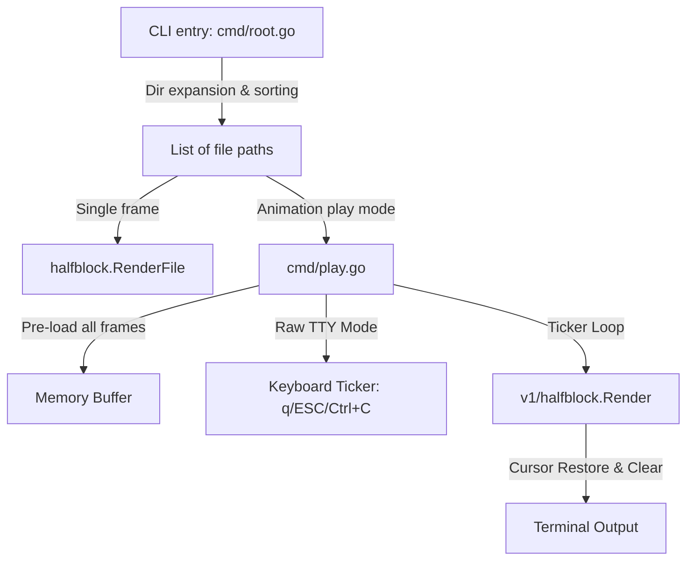

# Project Cati — System Documentation


This document captures the architecture, core design decisions, lessons learned, and utility systems of the **Cati** terminal image rendering utility.

---

## 1. Architecture & Rendering Pipeline

Cati is a lightweight terminal image and animation viewer written in Go. Its core logic is divided into CLI commands (`cmd/`) and the public rendering libraries under `v1/` (`v1/halfblock/`, `v1/quadblock/`, `v1/sextant/`, and `v1/sparkline/`), utilizing core types defined in `v1/core/` and terminal size detection utility in `v1/term/`.



### "Two Pixels, One Cell" Encoding
Cati encodes **two vertical pixels** into a single terminal cell using Unicode half-block characters.
This effectively doubles the vertical resolution of standard terminal dimensions.

| Character | Visual Representation | Target Pixels | Color Source |
| :--- | :--- | :--- | :--- |
| `▀` | Top half filled | Top pixel color, Bottom transparent | Foreground color = top; Background color = none |
| `▄` | Bottom half filled | Top transparent, Bottom pixel color | Foreground color = bottom; Background color = none |
| `█` | Fully filled | Top & Bottom identical colors | Foreground color = top/bottom |
| ` ` | Empty/Transparent | Both pixels transparent | None |

This is combined with 24-bit ANSI true-color escape sequences (`\x1b[38;2;R;G;Bm` for foreground and `\x1b[48;2;R;G;Bm` for background) to render full color images.

### Sub-System Documentation
For detail on specific components, refer to:
*   [Video & Audio Pipeline](Video.md) — Probes video streams, decodes rawvideo frames via ffmpeg pipe at display FPS, audio via ffplay.
*   [Interactive Grid Browser](Browser.md) — Renders paged thumbnails, decodes mouse/key navigation, and dynamically scales image grid layouts.
*   [Terminal Input System](Input.md) — `spec/input.yaml` tokenizer decision tree, `internal/input` package, SGR 1006 mouse, UTF-8 handling, `--input-test` TUI.
*   [Spec System & Browser Design](Design.md) — Spec-as-code YAML system, template engine, hint bar variables (`meta.*`, `ssim`, `last_key`, …).

---

## 2. Crucial Design Decisions & Lessons Learned

### Artifact-Free Animation Playback
*   **The Problem**: Early versions left artifacts when drawing frame sequences at high speed in play mode.
*   **The Solution**: Standardizing line updates. Before drawing each frame row, Cati prefixes the line with `\x1b[2K\r` (Clear Line + Carriage Return) to ensure no characters or artifacts from previous frames remain in the terminal columns.
*   **Tty Raw Mode**: For playback, TTY raw mode is temporarily entered to enable non-blocking keyboard reads. This allows users to immediately quit using `q`, `Q`, `ESC`, or `Ctrl+C` while maintaining perfect control over terminal state restoration.

### External Rasterization for Non-Raster Formats (SVG)
*   **The Problem**: `halfblock.LoadImage` decodes stills via Go's `image.Decode` registry (PNG/JPEG). SVG is vector, not raster — it has no fixed pixel grid, so it cannot be registered as another `image/*` decoder; it must be rasterized to an `image.Image` first.
*   **Options considered**: pure-Go SVG libraries (`oksvg`/`rasterx` — limited spec coverage, largely unmaintained; `tdewolff/canvas` — good coverage but a heavy transitive dependency tree) vs. shelling out to an external tool.
*   **The Decision**: shell out to **`rsvg-convert`** (librsvg), following the exact precedent `v1/halfblock/video.go` already set for `ffmpeg`/`ffprobe` — no availability guard, treated as an assumed environment dependency. `rsvg-convert` was chosen over `inkscape` or ImageMagick's `convert` because those pull in GTK/X11-adjacent toolkits even when run headlessly, which is a poor fit for server/CI environments; `rsvg-convert` is a small, single-purpose, headless CLI, matching `ffmpeg`'s footprint.
*   **Implementation**: `v1/halfblock/svg.go` — `RasterizeSVG` pipes `rsvg-convert --format=png -w 2048 <path>` output into `image/png.Decode` (the 2048px cap bounds memory on pathological inputs while preserving enough detail for typical terminal display and zoom). `ProbeSVGDimensions` avoids spawning a subprocess for metadata-only lookups (thumbnail hover, `meta.src_w/h`) by parsing just the root `<svg>` element's `width`/`height`/`viewBox` attributes with `encoding/xml.Decoder`, stopping after the first start element.
*   **Precedent for future formats**: any future non-raster or exotic format (WebP animations, PDF pages, …) should follow this same "assumed-present external CLI, no defensive availability check" pattern rather than adding a heavy Go dependency, unless the format's registry-based `image/*` decoder already exists in the standard library.

### Offline-First Website Compatibility
*   **CORS Tainting**: The website visualizes how the pixel grid encodes pixels using a JavaScript visualizer. Reading PNG pixels directly using canvas `getImageData()` throws a `SecurityError` in modern browsers if the website is opened directly from the local disk using the `file://` protocol.
*   **Static Inlining**: The pixel grid now bypasses the canvas entirely at runtime. The raw pixel colors are pre-extracted and inlined directly in `website/index.html`.
*   **Asset Generator**: A dedicated Go script (`scripts/generate_pixels.go`) is provided to parse the logo image and automate this inlining workflow inside the HTML via marker comments:
    ```javascript
    // PIXELS_START
    const pixelColors = [ ... ];
    // PIXELS_END
    ```

---

## 3. Tooling & Licensing

### Internal Package Decoupling (June 2026)

The quality metrics, image-geometry helpers, and pixel-art pre-scalers were extracted from `cmd/` into dedicated `internal/` packages. The key learnings:

*   **Pure math lives in `internal/`** — anything that depends only on `image`, `image/color`, and `math` should not sit in `cmd/`. It creates import coupling, bloats the UI package, and makes unit testing harder.
*   **Extracted packages**:
    - `internal/metrics` — SSIM, luminance, Sobel, box/pyramid downscale, blockiness, edge continuity. Zero project deps (stdlib only).
    - `internal/imgutil` — `FitPixelDims` (aspect-ratio fit, no upscale), `CropImage` (zero-copy SubImage for RGBA). Zero project deps.
    - `internal/pixelart` — `Scale2x`/`Scale3x`, `Sharpen`/`Sharpen05`/`Sharpen10`. Already extracted but had no tests (now has 9 tests).
*   **`RenderQuality` stays in `cmd/`** — the orchestrator that wires renderers + metrics together. Only the pure sub-computations were moved.
*   **Remove dead code during extraction.** `BlockMeanReconstruct` (block-colour quantisation model) was carried over from `cmd/ssim.go` but had zero callers. Extracting is a natural moment to prune.
*   **Functions used only within the package stay unexported.** `metrics.Luma` was exported initially, but no caller outside `internal/metrics` referenced it. Unexporting avoids committing to a public API that may change.
*   **Avoid package-name redundancy in exported names.** `metrics.QualityGridK` reads as "metrics quality grid K" — the `Quality` prefix is noise. `metrics.GridK` is shorter and unambiguous.

### Public Library Reorganization (July 2026)

To expose Cati's rendering algorithms as a public library, the core rendering modules were reorganized under `v1/`:
*   **`v1/core`** — Defines standard types `core.Cell` and `core.Grid` shared by all renderers.
*   **`v1/term`** — Implements cross-platform terminal size detection utilities (`term.TermWidth()` and `term.TermHeight()`).
*   **`v1/halfblock`, `v1/quadblock`, `v1/sextant`, `v1/sparkline`** — Implement the public Go APIs:
    - `Render(w io.Writer, img image.Image, cols int, opts Options) error`
    - `RenderToGrid(img image.Image, cols int, opts Options) (*core.Grid, error)`

### Viewport Geometry Extraction (June 2026)

The viewport geometry math (`term cells → renderer pixels → fit → zoom → clamp → crop`) is centralized in `internal/viewgeom` and consumed through thin app-layer wrappers:

*   **`Spec.ViewportDims` / `Spec.Dims`** — computes derived pixel dimensions from source size, terminal size, zoom, and renderer geometry. `Dims` is the preferred named result for callers that need to share the same geometry across pan, crop, reference generation, and rendering.
*   **`Dims.ClampPan`** — clamps pan offsets to the scaled image bounds. Panning must move the viewport origin (`panX`, `panY`) only; do not add mode-specific "frame" panning or snap grids unless a separate phase-control feature is being designed.
*   **`Dims.SrcCrop`** — maps viewport pixel coords back to source image coords. Used by `buildRef` for SSIM reference generation and by the hint-bar for `meta.src_res` (now shows the visible crop region when zoomed/panning instead of always showing full source resolution).
*   **`PanAnchor` / `Spec.PanFromAnchor` / `Spec.PanByCells`** — shared drag and keyboard-pan primitives. Individual render modes provide only their cell footprint via `viewSpec()`.

### Cell-Quantum Zoom Model (June 2026, revised June 2026)

The stable zoom and viewport helpers now live in `internal/viewgeom`. The app layer keeps thin wrappers, while the core model uses a **cell quantum** where each renderer declares how many source-pixel units one cell represents.

*   The stable user-facing unit is `src px/cell`, not `k`. `k` is an internal ladder parameter; the hint bar should report the actual source pixels represented by one terminal cell.
*   The common geometry is `n : 2n` source pixels per cell footprint. `n` is renderer-specific and must stay configurable so future glyph families can plug into the same math.
*   Zoom should step through distinct rendered footprints, not through linear arithmetic in `k`. Any candidate state that collapses to the same visible output after rounding is dead weight and should be dropped from the ladder.
*   Mode changes must preserve source-space center and aspect. Switching between halfblock, quad, and future modes should recenter from the source rectangle, not reuse the old viewport coordinates verbatim.
*   Subcell phase shifts are a separate axis from zoom. They belong in dedicated controls later; they should not be conflated with the zoom ladder itself.

**Ladder, not linear steps.** Zoom changes should move through distinct rendered footprints, not through arbitrary arithmetic increments in `k`. The step generator should derive candidate cell footprints from the image dimensions and render quantum, convert them to `src px / cell`, and drop states that do not change the actual output after rounding. This keeps small images from accumulating useless tail states and gives every mode one geometry path.

**Mode separation.** Zoom changes size only. Sampling phase / subcell offsets are a separate axis for later testing-only controls such as quadshift. SSIM and other quality metrics should compare through a common analysis grid so new glyph families can still be evaluated against the same baseline.

**Render-mode identity.** `renderCfg{}` is halfblock and id `0` must stay
halfblock. CLI startup canonicalizes the flag-derived renderer into the active
cycle entry so display names, geometry, metrics, and `r`/`R` cycling all agree.
The main app cycle is currently `halfblock → quad/splithalf → quad/edge-snap →
spark/quad → spark/best → sextant/2x3`; `--mode=h` starts at
halfblock, `--mode=qs` starts at `quad/splithalf`, `--mode=qe` starts at
`quad/edge-snap`, `--mode=sq` starts at `spark/quad`, `--mode=sb` starts at
`spark/best`, and `--mode=xs` starts at `sextant/2x3`.

**Panning invariant.** Pan state is the upper-left origin of the visible viewport in the scaled image. Halfblock, quad, spark, and sextant all use the same state and clamp path. Mode-specific code may translate terminal-cell deltas to viewport pixels through `viewSpec()`, but it must not pan a renderer-local output frame independently of the source viewport.

**Render-size invariant.** The interactive renderer validates terminal-cell size
before emitting ANSI. The expected footprint is derived from the untrimmed
source crop and zoom ladder first: columns are `ceil(cropW / k)`, rows are
`ceil(cropH / (2k))`. Renderer-specific lattice details, such as quad's even
pixel crop or spark's `4×8` glyph block, are applied after that and then
normalized back to the same terminal-cell footprint. Pressing `r` must not
change the image size; render-size mismatches after viewport construction are
hard errors, not best-effort renders.

**Static source-aspect invariant.** Static fitting validates the source aspect
at the center of the shared render pipeline before ANSI is emitted. The check
compares the source rectangle against the renderer viewport after applying the
mode's aspect correction and allows only one render-cell of quantization error
in each axis. A mode that would render a square `32×32` source into a squashed
viewport fails with a `render aspect mismatch` error instead of silently
producing output. Playback and static CLI paths call the checked pipeline
directly; test-only convenience callers panic on the same invariant so
regressions cannot pass unnoticed.

The sextant family keeps exactly one shipped algorithm: `xs` /
`sextant/2x3`. It uses a fixed `2×3` sample lattice and the rational sextant
aspect correction while the original zoom/pan view geometry remains shared with
the rest of the app. The experimental sextant search aliases and diagonal
geomshape family were removed; see `RenderExperimentLessons.md` for the short
postmortem.

The `2×3` glyph set covers 60 of the 64 possible bit masks. The empty (`0`) and
full (`63`) cells render as a space (with background fill); the remaining two —
the pure left column (`1·3·5`, mask `0b101010`) and right column (`2·4·6`, mask
`0b010101`) — have no dedicated sextant rune because Unicode reuses the existing
half-block characters `▌` (U+258C) and `▐` (U+2590). `sextantRuneByMask` maps
those two masks to the half-block glyphs explicitly; without them `displayMask`
returns `0` and the renderer emits `rune(0)` (a zero-width NUL) that shifts the
row and leaves the right edge unfilled (see issue #020).

**Decoupled step generation.** `zoomSteps(mz, srcW) []float64` returns a descending slice of zoom values. Handlers (`inc_zoom`, `dec_zoom`, scroll wheel) consume it via `stepIdx(zoom, steps) int` and never compute steps directly.

**Spec-driven levels** (June 2026). k-values come from `spec/zoom_levels.yaml`:
- `levels` — fixed fractional k-values near 1 (e.g. `0.5, 0.75, 1.25`)
- `extend` — strategy enum `halves`/`quarters`/`adaptive` for generating k from 1.0 up to `srcW`

The loader (`loadZoomLevels`) now delegates to the typed spec loader in `spec/load.go` (`spec.LoadZoomLevels()`), which uses `gopkg.in/yaml.v3` and still returns defaults on read/parse error through `sync.Once` lazy init. The app layer keeps the zoom ladder normalization thin and mode-agnostic. See `docs/Spec.md` for spec system conventions.

**Minimum rendered width: 1 cell.** Both the levels list and the extension loop are capped at `k ≤ srcW`. This guarantees the rendered image is never smaller than 1 terminal cell wide, regardless of what the spec contains. The `adaptive` extension widens its k jumps as the image gets larger so zooming out of small images does not feel linear and slow at high `k`.

**`maxZoom`** (`mz`) is computed dynamically:

```
zCol = cellCols × srcW / scaledW    (cellCols = 1 halfblock, 2 quad)
zRow = srcH / scaledH
maxZoom = max(min(zCol, zRow), 1.0)
```

This caps zoom at the 1-source-pixel-per-cell-column limit regardless of terminal resize or render-mode switch.

**Convergence at k=1.** When each cell shows 1×2 source pixels, all halfblock modes produce identical output. Quad modes also converge provided each 2×2 block has ≤ 2 colours (verified by `TestMaxZoomQuadConvergence`).

**`viewRows` consistency.** The `--zoom 1:1` flag must open at k=1.0, and `--zoom 0` / key `0` must fit the viewport. The old bug (opening at k≈1.03) was caused by `initialZoomRatio` using the full `termRows` in its maxZoom computation while `zoomLevel` and the render viewport used `termRows - 2` (reserving 2 rows for the viewer chrome). Fix: define `viewRows = max(1, termRows - viewerChromeRows)` once and use it consistently in `initialZoomRatio`, `zoomSteps`, `zoomLevel`, and all event-handler zoom calls. For image/video viewers, an explicit CLI `--height H` means `viewRows == H`; the terminal row budget is resolved as `H + viewerChromeRows` internally. Oversized interactive `--width` / `--height` values are clamped to the current terminal, so `--height` never requests more image rows than the terminal can display after viewer chrome.

**Step index invariant.** `stepIdx(zoom, steps)` returns the first index where `steps[i] ≤ zoom`. The sequence must be **strictly descending** — `stepIdx` assumes ascending clamped behaviour (zoom above `steps[0]` returns 0, zoom below `steps[last]` returns `last`). Building steps from a deduplicated map of k-values follows this pattern:

1. Collect k-values into a `map[float64]bool` (dedup)
2. Iterate map keys into a slice, then `sort.Float64Slice(ks).Sort()` (ascending k)
3. Forward-iterate the sorted ks: `steps[i] = mz / k` (ascending k → descending zoom)

The naive `steps[len-1-i]` reversed-index pattern is wrong — it produces ascending zoom, breaking `stepIdx`.

**Zoom level display.** The normal hint bar shows the nearest zoom ladder value using `%.3g` format (e.g. `src px/cell=0.75`, `src px/cell=1.25`). It is based on the rendered terminal-cell width, not the physical terminal width: small images can render narrower than the terminal, and a `32×32` image rendered as `32×16` cells reports `src px/cell=1`, not `0.4` in an 80-column terminal. The `Info` action (`i`) reports raw crop ratio, nearest ladder value, crop, aligned view size, trim, rendered cell size, and source size separately.

**Renderer reconstruction for quality metrics.** SSIM, blockiness, and edge continuity compare the ideal source crop against a reconstruction of what the terminal renderer actually emits. Halfblock is represented by the viewport image itself, quad uses `quadblock.RenderToImage`, and spark uses `sparkline.RenderToImage`. The rendered reconstruction is normalized to the common `metrics.GridK × metrics.GridK` per-terminal-cell quality grid: smaller outputs are nearest-neighbour upscaled, while denser outputs are pyramid-downscaled. Never compare spark quality against the raw NN viewport; that scores the sampler, not the glyph renderer.

### Viewer Core Consolidation (June 2026)

`interactiveWithChan` (image viewer) and `interactiveVideo` (video viewer) shared ~80% of their logic as independent duplicates. Every fix — zoom, pan, render-mode switch, `show_info`, `preserveZoomForMode` — had to be applied twice. The solution is `cmd/viewer_core.go`, a thin coordinator struct that both callers delegate to:

*   **`viewerCore` struct** holds all shared mutable state: `rc renderCfg`, `state viewState`, `drag dragState`, `curQ RenderQuality`, `modeName`, `lastNonHBID`, `buttons`, `activeAction`, `status`, `infoVisible`, `lastKey`, `lastVP`, `src image.Image`.
*   **`rerender func()`** is a callback set by the owning viewer: for images it builds from `orig`, for video it builds from `lastRawFrame`. The callback updates `vc.lastVP` and `vc.curQ` only — it never writes to screen.
*   **`handleAction(action, tok)`** owns all shared spec actions (`inc_zoom`, `dec_zoom`, `zoom_k`, `cycle_render*`, `toggle_gray`, `toggle_halfblock`, `copy_viewport`, `show_info`, `go_back`, `quit`). Returns `(false, false)` for viewer-specific actions so the caller can handle them.
*   **`handleKey` / `handleMouse`** return `(quit, changed bool, unhandledAction string)`. An `unhandledAction` is a spec action that the core did not claim — the owning viewer handles it (`toggle_pan` for image viewer, `toggle_play_pause` for video viewer).
*   **`switchMode(oldRC)`** calls `preserveZoomForMode` + `recenterForMode` in one step; replaces the inline duplicate in the image viewer and the `switchVideoMode` closure in the video viewer.

What stays local to each viewer: `spacePan`/`toggle_pan` (image), `paused`/`videoEnded`/`restartStream`/`setPaused`/`statusClearAt` (video). The ticker loop, frame channel, audio player, and input splitter remain in `interactiveVideo`.

Net result: `interactiveWithChan` 447→95 lines, `interactiveVideo` 553→115 lines, four dead wrapper functions deleted (`viewportDims`, `srcCrop`, `visibleCrop`, `renderView`).

### Line-Width Invariant (June 2026)

Every output path must emit at most `termCols` visible characters per terminal row. A silent overrun wraps to the next row, corrupting the layout without any error.

*   **Button bar** (`drawBottomMenu`): enforced via `fitMenuItems(items, maxCols)`. `maxCols` is `writerTermCols(w)` with `termCols` as fallback for non-tty writers (tests, pipes).
*   **Hint bar** (`drawHintBar`): enforced via `truncateANSI(text, cols-2)`. Same fallback logic.
*   **Pixel renders** (`rc.render`): pre-validated by `validateRenderSize` before ANSI emission; actual output width is verified in tests via `lineCapWriter`.

`lineCapWriter` (in `cmd/linecap_test.go`) is an `io.Writer` that decodes ANSI CSI sequences (skipping escape bytes) and counts visible UTF-8 runes per line, recording the maximum column reached. Tests call `lc.AssertFits(t, 80)` for all render modes and UI components.

The `termCols` fallback parameter was added to both `drawBottomMenu` and `drawHintBar` in the same step as the test addition, closing the gap where non-tty enforcement was silently skipped.

### Phony Sentinels in Makefiles
To keep targets phony without polluting the `Makefile` with lists of names, a sentinel target `⚙️` is used:
```makefile
.PHONY: ⚙️
target: ⚙️  ## Description
```
The Unicode emoji target acts as a phony trigger since no such file will exist on disk, keeping the Makefile clean.

### REUSE Licensing Specification
Cati is fully compliant with the **FSFE REUSE 3.3** specification:
*   Standard license texts reside under the `LICENSES/` directory.
*   The project uses `REUSE.toml` annotations with wildcard matches (`path = ["**"]`) to define license (`AGPL-3.0-or-later`) and copyright (`2026 Uwe Jugel`) for all repository files. This completely removes the need to put license headers at the top of code/media assets.
