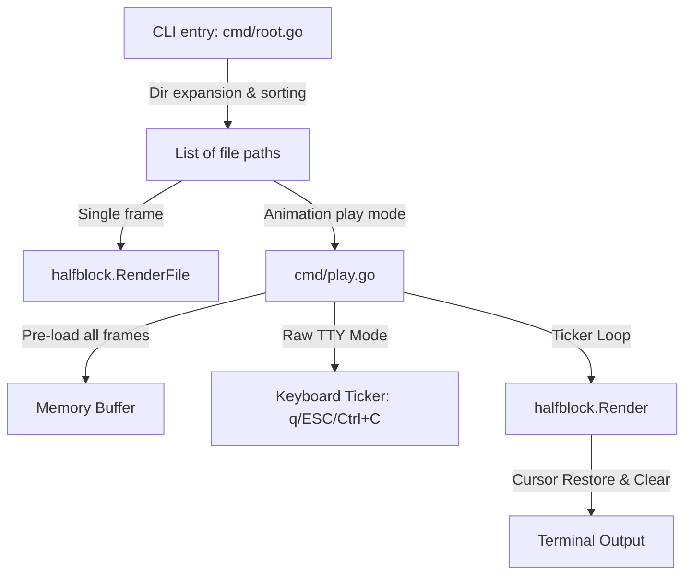

# Project Cati — System Documentation

This document captures the architecture, core design decisions, lessons learned, and utility systems of the **Cati** terminal image rendering utility.

---

## 1. Architecture & Rendering Pipeline

Cati is a lightweight terminal image and animation viewer written in Go. Its core logic is divided into CLI commands (`cmd/`) and the core rendering package (`internal/halfblock/`).



### "Two Pixels, One Cell" Encoding
Cati encodes **two vertical pixels** into a single terminal cell using Unicode half-block characters.
This effectively doubles the vertical resolution of standard terminal dimensions.

| Character | Visual Representation | Target Pixels | Color Source |
| :--- | :--- | :--- | :--- |
| `▀` | Top half filled | Top pixel color, Bottom transparent | Foreground color = top; Background color = none |
| `▄` | Bottom half filled | Top transparent, Bottom pixel color | Foreground color = bottom; Background color = none |
| `█` | Fully filled | Top & Bottom identical colors | Foreground color = top/bottom |
| ` ` | Empty/Transparent | Both pixels transparent | None |

This is combined with 24-bit ANSI true-color escape sequences (`\x1b[38;2;R;G;Bm` for foreground and `\x1b[48;2;R;G;Bm` for background) to render full color images.

### Sub-System Documentation
For detail on specific components, refer to:
*   [Video & Audio Pipeline](Video.md) — Probes video streams, decodes rawvideo frames via ffmpeg pipe at display FPS, audio via ffplay.
*   [Interactive Grid Browser](Browser.md) — Renders paged thumbnails, decodes mouse/key navigation, and dynamically scales image grid layouts.
*   [Terminal Input System](Input.md) — `spec/input.yaml` tokenizer decision tree, `internal/input` package, SGR 1006 mouse, UTF-8 handling, `--input-test` TUI.
*   [Spec System & Browser Design](Design.md) — Spec-as-code YAML system, template engine, hint bar variables (`meta.*`, `ssim`, `last_key`, …).

---

## 2. Crucial Design Decisions & Lessons Learned

### Artifact-Free Animation Playback
*   **The Problem**: Early versions left artifacts when drawing frame sequences at high speed in play mode.
*   **The Solution**: Standardizing line updates. Before drawing each frame row, Cati prefixes the line with `\x1b[2K\r` (Clear Line + Carriage Return) to ensure no characters or artifacts from previous frames remain in the terminal columns.
*   **Tty Raw Mode**: For playback, TTY raw mode is temporarily entered to enable non-blocking keyboard reads. This allows users to immediately quit using `q`, `Q`, `ESC`, or `Ctrl+C` while maintaining perfect control over terminal state restoration.

### Offline-First Website Compatibility
*   **CORS Tainting**: The website visualizes how the pixel grid encodes pixels using a JavaScript visualizer. Reading PNG pixels directly using canvas `getImageData()` throws a `SecurityError` in modern browsers if the website is opened directly from the local disk using the `file://` protocol.
*   **Static Inlining**: The pixel grid now bypasses the canvas entirely at runtime. The raw pixel colors are pre-extracted and inlined directly in `docs/index.html`.
*   **Asset Generator**: A dedicated Go script (`scripts/generate_pixels.go`) is provided to parse the logo image and automate this inlining workflow inside the HTML via marker comments:
    ```javascript
    // PIXELS_START
    const pixelColors = [ ... ];
    // PIXELS_END
    ```

---

## 3. Tooling & Licensing

### Phony Sentinels in Makefiles
To keep targets phony without polluting the `Makefile` with lists of names, a sentinel target `⚙️` is used:
```makefile
.PHONY: ⚙️
target: ⚙️  ## Description
```
The Unicode emoji target acts as a phony trigger since no such file will exist on disk, keeping the Makefile clean.

### REUSE Licensing Specification
Cati is fully compliant with the **FSFE REUSE 3.3** specification:
*   Standard license texts reside under the `LICENSES/` directory.
*   The project uses `REUSE.toml` annotations with wildcard matches (`path = ["**"]`) to define license (`AGPL-3.0-or-later`) and copyright (`2026 Uwe Jugel`) for all repository files. This completely removes the need to put license headers at the top of code/media assets.
