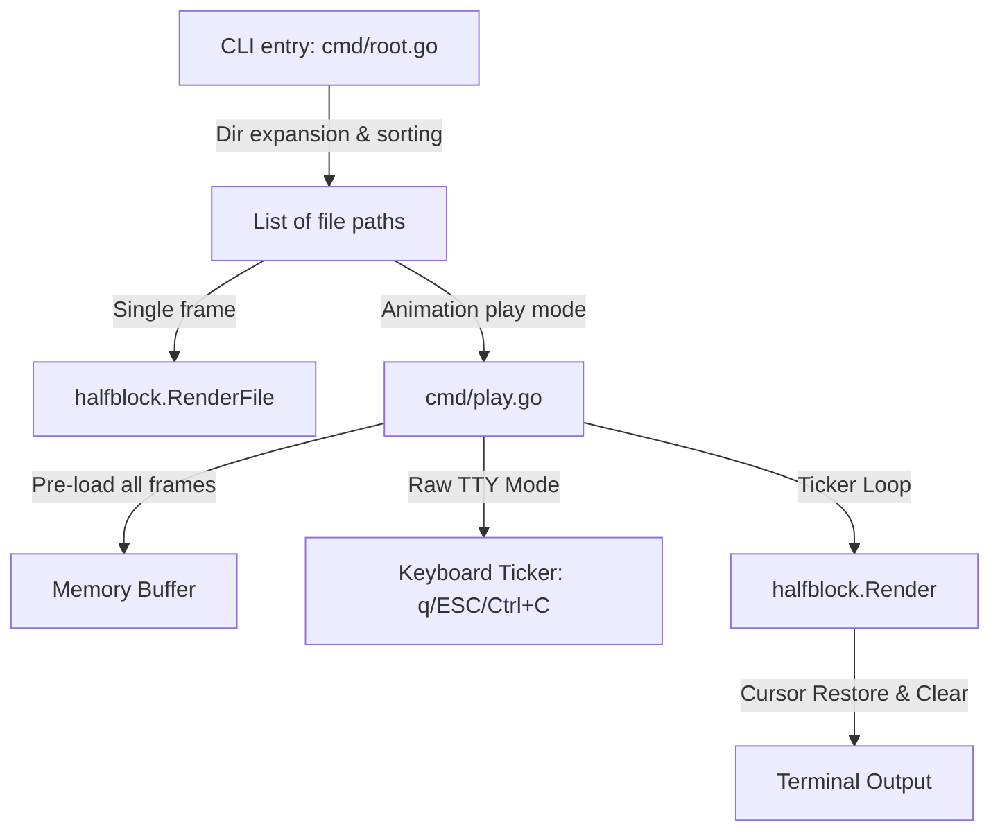

# Project Cati — System Documentation

This document captures the architecture, core design decisions, lessons learned, and utility systems of the **Cati** terminal image rendering utility.

---

## 1. Architecture & Rendering Pipeline

Cati is a lightweight terminal image and animation viewer written in Go. Its core logic is divided into CLI commands (`cmd/`) and the core rendering package (`internal/halfblock/`).



### "Two Pixels, One Cell" Encoding
Cati encodes **two vertical pixels** into a single terminal cell using Unicode half-block characters.
This effectively doubles the vertical resolution of standard terminal dimensions.

| Character | Visual Representation | Target Pixels | Color Source |
| :--- | :--- | :--- | :--- |
| `▀` | Top half filled | Top pixel color, Bottom transparent | Foreground color = top; Background color = none |
| `▄` | Bottom half filled | Top transparent, Bottom pixel color | Foreground color = bottom; Background color = none |
| `█` | Fully filled | Top & Bottom identical colors | Foreground color = top/bottom |
| ` ` | Empty/Transparent | Both pixels transparent | None |

This is combined with 24-bit ANSI true-color escape sequences (`\x1b[38;2;R;G;Bm` for foreground and `\x1b[48;2;R;G;Bm` for background) to render full color images.

### Sub-System Documentation
For detail on specific components, refer to:
*   [Video & Audio Pipeline](Video.md) — Probes video streams, decodes rawvideo frames via ffmpeg pipe at display FPS, audio via ffplay.
*   [Interactive Grid Browser](Browser.md) — Renders paged thumbnails, decodes mouse/key navigation, and dynamically scales image grid layouts.
*   [Terminal Input System](Input.md) — `spec/input.yaml` tokenizer decision tree, `internal/input` package, SGR 1006 mouse, UTF-8 handling, `--input-test` TUI.
*   [Spec System & Browser Design](Design.md) — Spec-as-code YAML system, template engine, hint bar variables (`meta.*`, `ssim`, `last_key`, …).

---

## 2. Crucial Design Decisions & Lessons Learned

### Artifact-Free Animation Playback
*   **The Problem**: Early versions left artifacts when drawing frame sequences at high speed in play mode.
*   **The Solution**: Standardizing line updates. Before drawing each frame row, Cati prefixes the line with `\x1b[2K\r` (Clear Line + Carriage Return) to ensure no characters or artifacts from previous frames remain in the terminal columns.
*   **Tty Raw Mode**: For playback, TTY raw mode is temporarily entered to enable non-blocking keyboard reads. This allows users to immediately quit using `q`, `Q`, `ESC`, or `Ctrl+C` while maintaining perfect control over terminal state restoration.

### Offline-First Website Compatibility
*   **CORS Tainting**: The website visualizes how the pixel grid encodes pixels using a JavaScript visualizer. Reading PNG pixels directly using canvas `getImageData()` throws a `SecurityError` in modern browsers if the website is opened directly from the local disk using the `file://` protocol.
*   **Static Inlining**: The pixel grid now bypasses the canvas entirely at runtime. The raw pixel colors are pre-extracted and inlined directly in `docs/index.html`.
*   **Asset Generator**: A dedicated Go script (`scripts/generate_pixels.go`) is provided to parse the logo image and automate this inlining workflow inside the HTML via marker comments:
    ```javascript
    // PIXELS_START
    const pixelColors = [ ... ];
    // PIXELS_END
    ```

---

## 3. Tooling & Licensing

### Internal Package Decoupling (June 2026)

The quality metrics, image-geometry helpers, and pixel-art pre-scalers were extracted from `cmd/` into dedicated `internal/` packages. The key learnings:

*   **Pure math lives in `internal/`** — anything that depends only on `image`, `image/color`, and `math` should not sit in `cmd/`. It creates import coupling, bloats the UI package, and makes unit testing harder.
*   **Extracted packages**:
    - `internal/metrics` — SSIM, luminance, Sobel, box/pyramid downscale, blockiness, edge continuity. Zero project deps (stdlib only).
    - `internal/imgutil` — `FitPixelDims` (aspect-ratio fit, no upscale), `CropImage` (zero-copy SubImage for RGBA). Zero project deps.
    - `internal/pixelart` — `Scale2x`/`Scale3x`, `Sharpen`/`Sharpen05`/`Sharpen10`. Already extracted but had no tests (now has 9 tests).
*   **`RenderQuality` stays in `cmd/`** — the orchestrator that wires renderers + metrics together. Only the pure sub-computations were moved.
*   **Remove dead code during extraction.** `BlockMeanReconstruct` (block-colour quantisation model) was carried over from `cmd/ssim.go` but had zero callers. Extracting is a natural moment to prune.
*   **Functions used only within the package stay unexported.** `metrics.Luma` was exported initially, but no caller outside `internal/metrics` referenced it. Unexporting avoids committing to a public API that may change.
*   **Avoid package-name redundancy in exported names.** `metrics.QualityGridK` reads as "metrics quality grid K" — the `Quality` prefix is noise. `metrics.GridK` is shorter and unambiguous.

### Viewport Geometry Extraction (June 2026)

The viewport geometry math (`pixelColumns ← termCols × (2 if quad else 1)`, then fit, zoom, clamp, crop) was duplicated across three functions. It was extracted into two shared helpers that now serve all callers:

*   **`viewportDims`** — computes derived pixel dimensions from source size, terminal size, zoom, and pixel-aspect mode. Returns `(pixCols, pixRows, scaledW, scaledH, viewW, viewH)` in a single call.
*   **`srcCrop`** — maps viewport pixel coords back to source image coords, returning the visible source rectangle. Used by `buildRef` for SSIM reference generation and by the hint-bar for `meta.src_res` (now shows the visible crop region when zoomed/panning instead of always showing full source resolution).
*   Both functions live in `cmd/` because they depend on the project-specific `useQuad` concept. They are pure (no I/O), table-driven test candidates.

### K-Sequence Zoom Model (June 2026)

The zoom model was changed from a fixed `maxZoom` constant (8×) with exponential `zoomStep` (1.25×) to a **k-sequence** where each level has a clear semantic meaning:

*   `zoom_k = maxZoom / k` for `k = 1 … K`, `K = floor(maxZoom)`
*   At `k=1`: each terminal cell shows exactly **1 source column × 2 source rows** (pixel-perfect, no sub-cell algorithm choice)
*   At `k=K`: image is fully zoomed out (fits the viewport), `zoom_K ≈ 1.0`
*   Each zoom action changes `k` by ±1, snapping to exact `maxZoom/k` values

**Decoupled step generation.** The step logic lives in `zoomSteps(mz) []float64` — a single function that returns the descending slice of zoom values. Zoom action handlers (`inc_zoom`, `dec_zoom`, scroll wheel) consume it via `stepIdx(zoom, steps) int`, and never compute step values directly. Replacing `zoomSteps` changes the step behaviour everywhere without touching handler logic.

**`maxZoom`** is no longer a constant. It is computed dynamically from source dimensions, terminal size, and render mode:

```
zCol = cellCols × srcW / scaledW    (cellCols = 1 halfblock, 2 quad)
zRow = srcH / scaledH
maxZoom = max(min(zCol, zRow), 1.0)
```

This ensures the zoom never exceeds the 1-source-pixel-per-cell-column limit regardless of terminal resize or render-mode switch.

**Convergence at k=1.** When each terminal cell shows exactly 1×2 source pixels, every halfblock-rendered mode produces the same output (no colour-pair selection to do). Quad modes also converge provided each 2×2 block contains ≤ 2 colours (verified by `TestMaxZoomQuadConvergence`).

**Zoom level in the hint bar.** The current k value is exposed as `zoom_level` in the hint-bar template (`spec/labels.yaml`). It is computed directly from `round(maxZoom / zoom)` without allocating the step slice.

### Phony Sentinels in Makefiles
To keep targets phony without polluting the `Makefile` with lists of names, a sentinel target `⚙️` is used:
```makefile
.PHONY: ⚙️
target: ⚙️  ## Description
```
The Unicode emoji target acts as a phony trigger since no such file will exist on disk, keeping the Makefile clean.

### REUSE Licensing Specification
Cati is fully compliant with the **FSFE REUSE 3.3** specification:
*   Standard license texts reside under the `LICENSES/` directory.
*   The project uses `REUSE.toml` annotations with wildcard matches (`path = ["**"]`) to define license (`AGPL-3.0-or-later`) and copyright (`2026 Uwe Jugel`) for all repository files. This completely removes the need to put license headers at the top of code/media assets.
