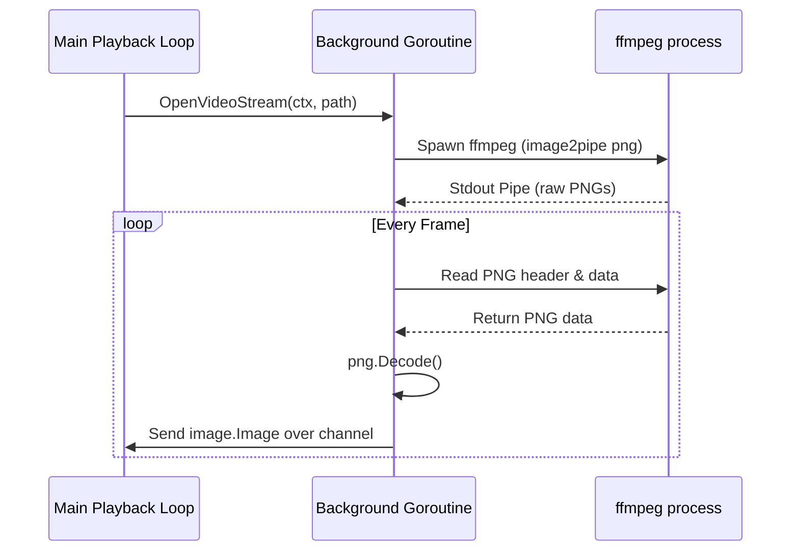

# Video Probing & Streaming Pipeline

This document describes the video probing, decoding, and streaming pipeline in Cati.

---

## 1. Video Detection & Probing

Cati detects video files transparently by checking file extensions against a set of supported video types (`.mp4`, `.webm`, `.mkv`, `.mov`, `.avi`).

```go
var VideoExts = map[string]bool{
	".mp4":  true,
	".webm": true,
	".mkv":  true,
	".mov":  true,
	".avi":  true,
}
```

### Frame Rate Autodetection
When `--play` is used with a video file and no explicit `--fps` is provided, Cati uses `ffprobe` to query the native frame rate of the first video stream:
*   Executes `ffprobe -v quiet -select_streams v:0 -show_entries stream=r_frame_rate -of csv=p=0 <path>`.
*   Parses fractional fractions (e.g., `30000/1001` or `25/1`) to derive exact floating-point FPS.
*   Defaults to a fallback of `15` FPS if probing fails or `ffprobe` is missing.

---

## 2. Multi-Threaded Streaming Architecture

To avoid decoding latency causing playback stutter, video frames are decoded concurrently using a background worker.



### Process Integration
*   The worker spawns `ffmpeg` configured with `-f image2pipe -vcodec png pipe:1` to stream frames sequentially into standard output as consecutive PNG files.
*   A background goroutine calls `png.Decode` on the stream reader. Go's image decoder reads exactly one PNG chunk sequence at a time and returns the decoded image, stopping at the end of the image file boundary.
*   Decoded frames are sent over a buffered channel (`chan image.Image`) to the main loop.

---

## 3. Flow Control & Frame Dropping

Terminal playback loops must synchronize frame arrival with the system timer while avoiding lag caused by decode queues.

```go
case <-ticker.C:
	if lastFrame == nil {
		continue
	}
	halfblock.CursorHome(os.Stdout)
	halfblock.Render(os.Stdout, lastFrame)
	halfblock.EraseDown(os.Stdout)

	// Drop stale buffered frames to stay in sync with the ticker.
	n := len(frames) - 1
	for i := 0; i < n; i++ {
		if img, ok := <-frames; ok {
			lastFrame = ScaleToFit(img, cols, rows)
		}
	}
```

*   **Lag Prevention**: If the background decoder runs faster than the terminal rendering loop, frames back up in the channel buffer. When the ticker triggers, Cati drains all but the latest frame in the queue.
*   **Performance**: This guarantees that the viewer displays the most recent real-time frame, avoiding cumulative audio-video desynchronization.

---

## 4. Failure Prevention

To prevent infinite process-spawning loops when loading corrupt or missing video files, Cati tracks consecutive failures:
*   If a video fails to decode any frames, the stream channel is closed immediately.
*   On closure, the playback loop increments `consecutiveFailures`.
*   If `consecutiveFailures` equals or exceeds the total number of files in the playback queue, Cati stops immediately and reports the failure.
