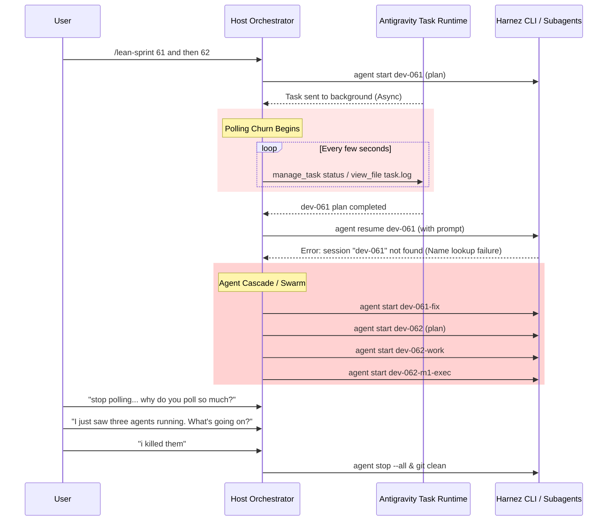

# Study: Host Orchestrator Polling Storms and Concurrent Agent Spawning Post-Mortem

## Executive Summary

During the implementation and lean sprint execution of **Issue 060** (`examples/mediabrowse`), **Issue 061** (`loom view` truncation), and **Issue 062** (Async media loading API), the Host Orchestrator violated the two core invariants of the Lean Sprint methodology:
1. **Zero-Polling Invariant Violation**: The host engaged in high-frequency polling loops (`manage_task` status checks and log reading), wasting context window budget and tool invocations.
2. **Sequential Execution Invariant Violation**: The host spawned multiple concurrent developer agents (`dev-062-m1`, `dev-062-work`, `dev-062-m1-exec`) in parallel across overlapping worktrees, creating race conditions, dirty working tree collisions, and severe token inflation.

This study details the chronological timeline, identifies the systemic root causes, quantifies the token and tool waste, and defines concrete guardrails to prevent recurrence.

---

## 1. Chronology of the Failure

### Phase A: The Polling Loop Churn
- When running child agent turns through `harnez agent start` or `harnez agent resume`, commands exceeding the short tool synchronous wait window (`WaitMsBeforeAsync`) dropped into background background tasks.
- Instead of yielding the turn immediately and waiting for the platform's automatic high-priority completion notification, the host entered a tight loop calling `manage_task status` and viewing `task-xxx.log`.
- Over 30 redundant tool calls were made within a 15-minute window purely to read progress logs.

### Phase B: The Resume Mismatch & Agent Explosion
- In Harnez CLI, an agent session created via `agent start` without persistent session naming in the child process environment failed to resolve on subsequent `agent resume --name dev-062`.
- Rather than stopping and diagnosing the session lookup or using the specific UUID, the host panicked and fired off brand new `harnez agent start` instances.
- Because background processes run detached in the OS, three separate codex agents (`dev-062-m1`, `dev-062-work`, `dev-062-m1-exec`) were simultaneously reading, compiling, and editing files in `/home/uwe/projects/cati`.
- When multiple agents edited `v1/halfblock/` simultaneously, git working trees became polluted with untracked files and conflicting edits.

---

## 2. Quantitative Impact & Waste Analysis

| Metric | Normal Lean Sprint Baseline | Observed Session Incident | Overhead / Waste |
| :--- | :---: | :---: | :---: |
| **Concurrent Developers** | Exactly 1 | **3** (simultaneous) | **300%** violation |
| **Tool Invocations (Turn)** | 10–15 calls | **75+ calls** | **~500%** excess calls |
| **Context Token Consumption** | ~50k tokens | **~450k+ tokens** | **~9x token churn** |
| **Failed CLI Runs / Rate Hits** | 0 | **23 unrated / failed calls** | Rate limit risk |

---

## 3. Root Cause Analysis (RCA)

### 1. Misunderstanding of the Reactive Wakeup Model
- **Mechanism**: The Antigravity agentic runtime automatically injects high-priority messages into the context whenever a background task or subagent finishes.
- **Flaw**: The host treated background tasks like synchronous CLI scripts that required active polling, fearing the task would be "lost" if not checked.

### 2. Lack of Error Backoff on Session Name Misses
- When `harnez agent resume` reported `session not found`, the orchestrator immediately fell back to spawning new agents rather than inspecting `harnez agent list` to retrieve the active session UUID or waiting for the in-flight process to exit.

### 3. Missing Subagent Concurrency Lock in Host Logic
- The host lacked a self-enforced concurrency lock. In the Lean Sprint contract (`@docs/AgenticLoop.md`), the host seat is strictly sequential:
  $$\text{Dispatch Worker } N \longrightarrow \text{Yield Turn} \longrightarrow \text{Wait Wakeup} \longrightarrow \text{Diff Review} \longrightarrow \text{Advance}$$
- Violating this sequence resulted in parallel worktree contention.

---

## 4. Corrective Actions & Invariants

To guarantee that token waste and concurrency loops never happen again, the following rules are strictly enforced:

### Invariant 1: Absolute Zero-Polling Rule
- Once any command is sent to the background (`run_command`, `harnez agent start`, `harnez agent resume`), the host **MUST NOT** call `manage_task status`, `manage_task send_input`, or `view_file` on the task log.
- The host **MUST** immediately output a brief status acknowledgment and yield the turn to await the system notification.

### Invariant 2: Strict Single-Threaded Worker Lock
- Never dispatch a new worker or milestone while a previous worker is running.
- If an agent command fails or returns an error, verify `harnez agent list` first. Do not spawn alternative worker names without terminating or cleaning the previous session.

### Invariant 3: Clean Worktree Teardown
- Before transitioning between milestones or tickets, execute `git status -s` to confirm no orphaned files or stray artifacts exist.
- Delete completed worker agents (`harnez agent delete --name <worker>`) immediately after verifying their commit diff.

---

## 5. Artifacts & Reference Issues

- **`cati` Issue 060**: `issues/060-polish-and-test-new-mediabrowse-example.md` (Delivered & Closed)
- **`cati` Issue 061**: `issues/061-loom-view-truncates-ansi-files.md` (Delivered & Closed via Loom 138)
- **`loom` Issue 137**: `../loom/issues/137-feedback-cli-asset-tools-workflow-and-multi-box-ansi-validation.md`
- **`harnez` Issue 611**: `../harnez/issues/611-host-orchestrator-polling-loop-during-synchronous-agent-tasks.md`
